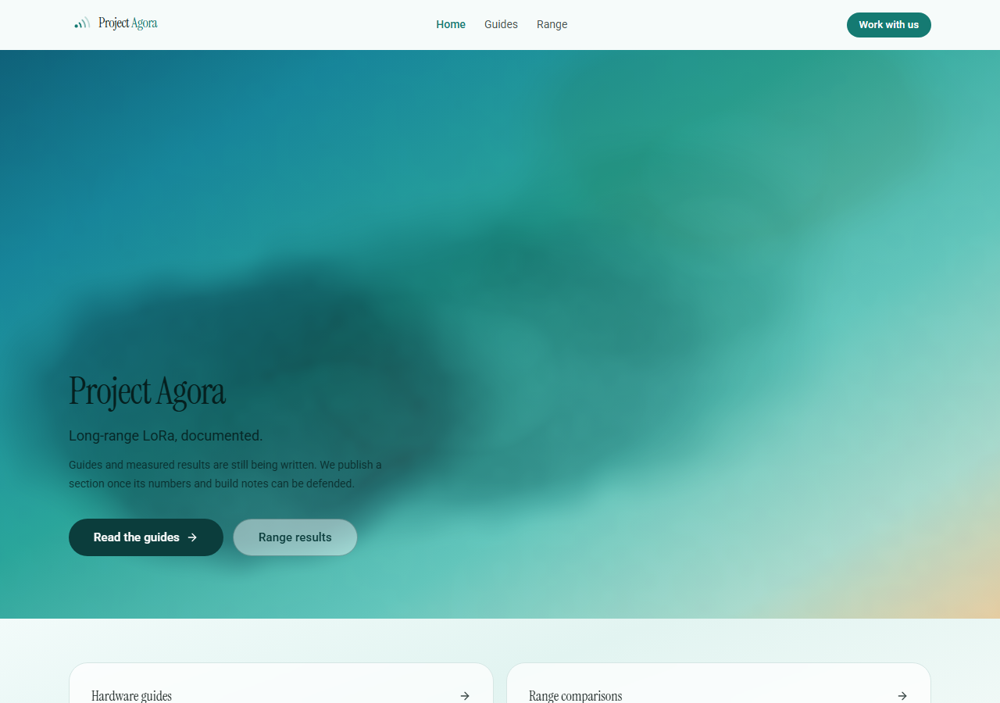
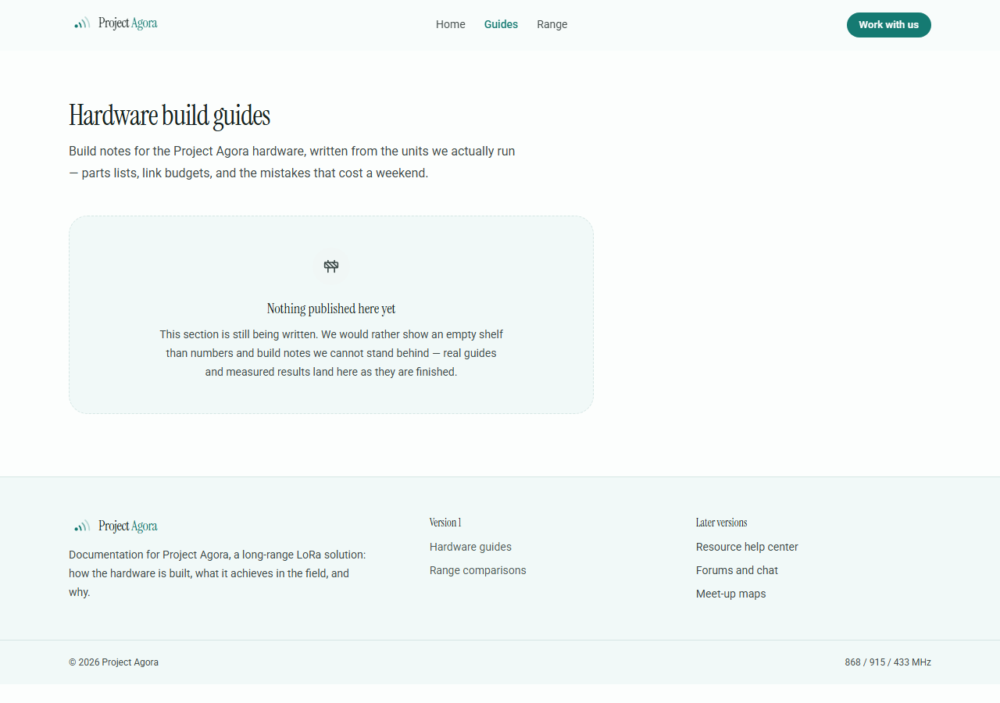

## Overview

This project uses the following tech stack:
- Vite
- Typescript
- React Router v7 (all imports from `react-router` instead of `react-router-dom`)
- React 19 (for frontend components)
- Tailwind v4 (for styling)
- Shadcn UI (for UI components library)
- Lucide Icons (for icons)
- Convex (for backend & database)
- Convex Auth (for authentication)
- Framer Motion (for animations)
- feral-react-gradient (`Lagoon.jsx`) — the watercolour engine behind the landing hero

All relevant files live in the 'src' directory.

Use bun for the package manager.



## Colour and type: CLEAR HANADA + Instrument Serif

The site runs on the CLEAR HANADA stop (`#30A7A0`) from the `Lagoon`
watercolour recipe. The primary is that hue darkened one tonal step to `#157A72`
so white button text keeps AA contrast; chart slots follow the hanada → lagoon
ramp rather than the old pink M3 set.

No surface on the site is pure white. `public/lagoon.jpg` is the full 1920×1080
lagoon render with the "Project Agora" wordmark baked into its middle band;
`public/lagoon-paper.svg` wraps it in a 900×450 `viewBox` that crops to the
wordmark-free upper-left quadrant and lays a 66% white veil over it, so the tile
reads as pale paper. The `body` in `src/index.css` repeats that tile at 720px with
`background-attachment: fixed`, and the base tokens moved off white accordingly
(`--background: #f6fbfa`, `--card: #fbfefe`, surface tiers into the lagoon
family). `prefers-reduced-transparency` drops the image and falls back to the
flat token colour.

Because that paper lives on `body`, nothing opaque may sit on top of it on the
documentation pages, and `AppHeader` is `bg-background/80 backdrop-blur-md`
rather than a solid bar — a fixed opaque header would mask the paper across the
full width of every page. The landing is the one deliberate exception: its hero
is finished artwork, and it is meant to cover the paper.

## The landing is the artwork

`Lagoon.jsx` in the repo root is the generated feral-react-gradient export whose
recipe is `Lagoon`: an animated WATERCOLOR wash — five soft washes laid over
paper grain and driven by its own clock. `src/pages/Landing.tsx` stretches that
component across the whole first viewport (`position: absolute; inset: 0;
aspectRatio: auto`) instead of leaving it in its natural 2048×1506 box, so the
page itself is the piece. `.gradient-lagoon` stays behind it purely as a flat
fallback colour field, and `src/components/site/SignalBurst.tsx` draws the
BrandMark's LoRa arcs at poster scale over the wash — four staggered pulses, a
dashed orbit, a beacon dot — with the keyframes in `src/index.css`, all of them
switched off under `prefers-reduced-motion`.

The copy is deliberately minimal (wordmark, one line, two links) and reveals
with a Framer Motion fade-up that is skipped entirely when the visitor prefers
reduced motion. The guides/range entry cards and the footer band were dropped
from this page; the header nav carries those links. Display type is Instrument
Serif (headings, wordmark); body and code stay on Roboto. Instrument Serif ships
one weight, so headings are pinned to `font-normal` rather than asking for a
synthesised bold.

`src/components/site/LagoonWash.tsx` was the earlier hand-rolled CPU wash. The
generated engine replaced it on the landing, no import referenced it, and the
file has been deleted rather than left to rot.

Below the hero, `src/components/site/LandingIntro.tsx` adds the German project
content: what AGORA is, three live figures, and the list of sections. The hero
itself was not touched — it is only boxed into a fixed-height `<section>` so
something can follow it. `docs/landing.png` still shows the hero as delivered
and says nothing about what is now underneath it.

## The AGORA pages (German)

Nine pages carry the school project, in German, alongside the English guides and
range pages:

| Route | Page | What it is |
| --- | --- | --- |
| `/live` | Live-Daten | Last reading per node, with the age of every measurement |
| `/statistiken` | Statistiken | Series, min/avg/max and the uplink log; node and range live in the query string |
| `/karte` | Karte | Station, nodes and per-spreading-factor range circles |
| `/station` | Funkstation | Hardware, specs, energy budget, and the five-stage signal path |
| `/lorawan` | LoRaWAN | Uplink/downlink, ALOHA, and a real airtime calculation |
| `/funktechnik` | Funktechnik | Frequency, range per SF, link budget, per-node headroom |
| `/glossar` | Glossar | 16 terms, grouped along the signal path |
| `/projekt` | Projekt | Roles, build, current status |
| `/export` | Export | CSV and JSON per node and range |

`src/components/data/ArchitectureDiagram.tsx` is the numbered rail used on both
`/station` and `/projekt`; `src/components/data/StationMap.tsx` is the SVG map.
The map is hand-drawn rather than tiled on purpose — a Leaflet layer would need
the network to answer, which is a bad property for a page demonstrated in a
classroom, and the footprint is under two kilometres across. The projection
carries a cos(latitude) correction so the range circles stay circular; Mercator
would shear them and quietly misstate the reach.

### Design system additions

The new pages extend the landing's vocabulary rather than inventing a dashboard.
`site/PageHero.tsx` is the hero shortened to 52svh with a title in it, reusing
the same three layers and steering `Lagoon.jsx` only through its props.
`site/Figure.tsx` sets a number like a figure in a report — label, large value,
caption, one hairline above it, **no card**. `site/Reveal.tsx` is the landing's
fade-up lifted out so it stops being copy-pasted; `Landing.tsx` keeps its own
inline variants because that hero arrived finished in one commit and is not worth
re-plumbing. `site/DataTable.tsx` is a ruled table, `site/LiveBadge.tsx` an
age indicator.

`Figure` has a `variant="ticking"` that switches to the sans face with tabular
figures. Instrument Serif has no tabular figures, so a value that rewrites every
few seconds visibly jitters in it — the wrong signal on a page whose job is to
say whether a number changed.

## Where the numbers come from

`src/lib/telemetry.ts` is a pure, deterministic model of the station.
`valueAt(node, ts)` takes a timestamp as an argument, never reads the clock and
never calls `Math.random()`, so the same node and timestamp always produce the
same reading. It contains the physics rather than a lookup table: free-space
path loss with terrain shadowing for RSSI, a diurnal curve plus a slow weather
front for temperature, and the Semtech AN1200.22 formula for airtime. Roughly one
slot in sixteen is a real gap, so the charts show that the data is not a smooth
invention.

`src/data/fixtures.ts` is the one place the station is configured, and the one
place the coordinates are wrong. **The lat/lng there are placeholders**,
roughly central Berlin so the map has a sensible area to project. Replace them
and the range model, the link budget, the map and the airtime table all follow,
because they all read the same numbers.

`src/data/measurements.ts` is the seam every page reads through. Each function
takes `now` rather than reading the clock, so a caller can freeze time and the
export can never disagree with the screen. Today the bodies call the generator;
when a backend is connected they become query calls and no page changes.

### Convex is wired but not connected

`src/convex/schema.ts` declares four tables — `stations`, `nodes`, `readings`,
`uplinks` — with the indices the read queries will need. The pages do not read
them yet, and that is deliberate: this checkout has no deployment,
`VITE_CONVEX_URL` is the placeholder `https://placeholder-123.convex.cloud`, so
`src/convex/_generated` does not exist. Any `query` or `mutation` written against
it would fail to compile and could not be exercised, so the site answers from the
generator instead and needs no credentials. The schema file carries the
four-step switch-over.



The guides and range pages are honest placeholders until real build notes and
measured field results exist: `src/data/guides.ts` and `src/data/range.ts` held
invented content and were deleted. Both pages now render the shared
`ComingSoon` component in `src/components/site/ComingSoon.tsx`.

## Setup

This project is set up already and running on a cloud environment, as well as a convex development in the sandbox.

## Environment Variables

The project is set up with project specific CONVEX_DEPLOYMENT and VITE_CONVEX_URL environment variables on the client side.

The convex server has a separate set of environment variables that are accessible by the convex backend.

Currently, these variables include auth-specific keys: JWKS, JWT_PRIVATE_KEY, and SITE_URL.

## Deploying to GitHub Pages

`.github/workflows/deploy.yml` builds on every push to `main` and publishes `dist/`. The Convex backend stays hosted on Convex Cloud — Pages only serves the static frontend, so there is no server component to host.

Repository **Actions → Variables**:

| Variable | Required | Purpose |
| --- | --- | --- |
| `VITE_CONVEX_URL` | yes | Convex deployment URL, baked into the bundle at build time. |
| `CONVEX_DEPLOYMENT` | yes | Deployment name, used by the codegen step. |
| `BASE_PATH` | no | Defaults to `/`. Only needed for subpath hosting. |
| `PAGES_DOMAIN` | no | When set, the workflow writes `dist/CNAME` for custom-domain hosting. |

Repository **Settings → Secrets**: `CONVEX_DEPLOYMENT_KEY` (a Convex admin key for the deployment). Codegen introspects the live deployment, which is why `src/convex/_generated/` — gitignored — does not need to be committed.

In the repository, set **Settings → Pages → Source** to **GitHub Actions** once, before the first run.

### Custom domain vs subpath

For a custom domain at the apex, `BASE_PATH` stays unset and every asset resolves against `/`. To host on `https://<user>.github.io/project-agora/` instead, set `BASE_PATH=/project-agora/`; the `pagesFallback` plugin in `vite.config.ts` keeps the 404 redirect pointed at that prefix.

Note that `VITE_CONVEX_URL` is embedded in public JavaScript by design — it is a deployment identifier, not a secret. The admin key is the only value that must stay in secrets.

### Deep links and the auth callback

GitHub Pages has no SPA rewrite, so `/guides` or `/dashboard` would serve its 404 rather than the app. `public/404.html` parks the requested path in `sessionStorage` and redirects to the base; `src/main.tsx` restores it with `history.replaceState` **before** `createRoot`, so the router's first render already sees the right URL. That ordering matters for Convex Auth, whose `/callback` exchange only fires when the provider boots on that exact path.

### One known build blocker — resolved

An earlier state passed `2` as the second argument to `formatNumber`, whose
signature in `src/lib/format.ts` was `digits: 0 | 1`. `vite build` does not
typecheck, so the site still ran, but `tsc -b` inside `bun run build` failed and
turned the workflow red. `formatNumber` now accepts `0 | 1 | 2`, which is what
the LoRa data rates need — 0.25 kbit/s at SF12 rounds to "0" at zero decimals
and to a correct "0,3" at two.

Two errors remain in `tsc -b`, and both predate the AGORA pages: `users.ts` and
`hooks/use-auth.ts` import from `src/convex/_generated`, which is gitignored and
generated by `npx convex dev`. They clear the moment a real deployment is
configured; nothing in the new code imports it.


# Using Authentication (Important!)

You must follow these conventions when using authentication.

## Auth is already set up.

All convex authentication functions are already set up. The auth currently uses email OTP and anonymous users, but can support more.

The email OTP configuration is defined in `src/convex/auth/emailOtp.ts`. DO NOT MODIFY THIS FILE.

Also, DO NOT MODIFY THESE AUTH FILES: `src/convex/auth.config.ts` and `src/convex/auth.ts`.

## Using Convex Auth on the backend

On the `src/convex/users.ts` file, you can use the `getCurrentUser` function to get the current user's data.

## Using Convex Auth on the frontend

There is currently no sign-in UI: the team sign-in button, the `/auth` route, and
`src/pages/Auth.tsx` were removed, and `/dashboard` is public. The Convex auth
stack (providers, backend, `useAuth` hook) is still wired up and ready if
accounts come back.

You MUST use this hook to get user data. Never do this yourself without the hook:
```typescript
import { useAuth } from "@/hooks/use-auth";

const { isLoading, isAuthenticated, user, signIn, signOut } = useAuth();
```

## Protected Routes

`/dashboard` is public, and the `RequireAuth` wrapper was removed along with the
sign-in flow. If accounts return, restore `RequireAuth` (or an equivalent gate)
before adding a route that needs a signed-in user, and give the blocked screen a
`title` and `description` so visitors know what they are missing.

## Authorization

You can perform authorization checks on the frontend and backend.

On the frontend, you can use the `useAuth` hook to get the current user's data and authentication state.

You should also be protecting queries, mutations, and actions at the base level, checking for authorization securely.

## Complete authenticated products

When the requested product implies accounts, a workspace, a dashboard, or other
signed-in functionality, the task is not complete with only a landing page and
auth form. Build the main authenticated experience, protect its route, and verify
that signing in reaches it.

# Frontend Conventions

You will be using the Vite frontend with React 19, Tailwind v4, and Shadcn UI.

Generally, pages should be in the `src/pages` folder, and components should be in the `src/components` folder.

Shadcn primitives are located in the `src/components/ui` folder and should be used by default.

## Page routing

Your page component should go under the `src/pages` folder.

When adding a page, update the react router configuration in `src/main.tsx` to include the new route you just added.

## Shad CN conventions

Follow these conventions when using Shad CN components, which you should use by default.
- Remember to use "cursor-pointer" to make the element clickable
- For title text, use the "tracking-tight font-bold" class to make the text more readable
- Always make apps MOBILE RESPONSIVE. This is important
- AVOID NESTED CARDS. Try and not to nest cards, borders, components, etc. Nested cards add clutter and make the app look messy.
- AVOID SHADOWS. Avoid adding any shadows to components. stick with a thin border without the shadow.
- Avoid skeletons; instead, use the loader2 component to show a spinning loading state when loading data.


## Landing Pages

You must always create good-looking designer-level styles to your application. 
- Make it well animated and fit a certain "theme", ie neo brutalist, retro, neumorphism, glass morphism, etc

Use known images and emojis from online.

If the user is logged in already, show the get started button to say "Dashboard" or "Profile" instead to take them there.

## Responsiveness and formatting

Make sure pages are wrapped in a container to prevent the width stretching out on wide screens. Always make sure they are centered aligned and not off-center.

Always make sure that your designs are mobile responsive. Verify the formatting to ensure it has correct max and min widths as well as mobile responsiveness.

- Always create sidebars for protected dashboard pages and navigate between pages
- Always create navbars for landing pages
- On these bars, the created logo should be clickable and redirect to the index page

## Animating with Framer Motion

You must add animations to components using Framer Motion. It is already installed and configured in the project.

To use it, import the `motion` component from `framer-motion` and use it to wrap the component you want to animate.


### Other Items to animate
- Fade in and Fade Out
- Slide in and Slide Out animations
- Rendering animations
- Button clicks and UI elements

Animate for all components, including on landing page and app pages.

## Three JS Graphics

Your app comes with three js by default. You can use it to create 3D graphics for landing pages, games, etc.


## Colors

You can override colors in: `src/index.css`

This uses the oklch color format for tailwind v4.

Always use these color variable names.

Make sure all ui components are set up to be mobile responsive and compatible with both light and dark mode.

Set theme using `dark` or `light` variables at the parent className.

## Styling and Theming

When changing the theme, always change the underlying theme of the shad cn components app-wide under `src/components/ui` and the colors in the index.css file.

Avoid hardcoding in colors unless necessary for a use case, and properly implement themes through the underlying shad cn ui components.

When styling, ensure buttons and clickable items have pointer-click on them (don't by default).

Always follow a set theme style and ensure it is tuned to the user's liking.

## Toasts

You should always use toasts to display results to the user, such as confirmations, results, errors, etc.

Use the shad cn Sonner component as the toaster. For example:

```
import { toast } from "sonner"

import { Button } from "@/components/ui/button"
export function SonnerDemo() {
  return (
    <Button
      variant="outline"
      onClick={() =>
        toast("Event has been created", {
          description: "Sunday, December 03, 2023 at 9:00 AM",
          action: {
            label: "Undo",
            onClick: () => console.log("Undo"),
          },
        })
      }
    >
      Show Toast
    </Button>
  )
}
```

Remember to import { toast } from "sonner". Usage: `toast("Event has been created.")`

## Dialogs

Always ensure your larger dialogs have a scroll in its content to ensure that its content fits the screen size. Make sure that the content is not cut off from the screen.

Ideally, instead of using a new page, use a Dialog instead. 

# Using the Convex backend

You will be implementing the convex backend. Follow your knowledge of convex and the documentation to implement the backend.

## The Convex Schema

You must correctly follow the convex schema implementation.

The schema is defined in `src/convex/schema.ts`.

Do not include the `_id` and `_creationTime` fields in your queries (it is included by default for each table).
Do not index `_creationTime` as it is indexed for you. Never have duplicate indexes.


## Convex Actions: Using CRUD operations

When running anything that involves external connections, you must use a convex action with "use node" at the top of the file.

You cannot have queries or mutations in the same file as a "use node" action file. Thus, you must use pre-built queries and mutations in other files.

You can also use the pre-installed internal crud functions for the database:

```ts
// in convex/users.ts
import { crud } from "convex-helpers/server/crud";
import schema from "./schema.ts";

export const { create, read, update, destroy } = crud(schema, "users");

// in some file, in an action:
const user = await ctx.runQuery(internal.users.read, { id: userId });

await ctx.runMutation(internal.users.update, {
  id: userId,
  patch: {
    status: "inactive",
  },
});
```


## Common Convex Mistakes To Avoid

When using convex, make sure:
- Document IDs are referenced as `_id` field, not `id`.
- Document ID types are referenced as `Id<"TableName">`, not `string`.
- Document object types are referenced as `Doc<"TableName">`.
- Keep schemaValidation to false in the schema file.
- You must correctly type your code so that it passes the type checker.
- You must handle null / undefined cases of your convex queries for both frontend and backend, or else it will throw an error that your data could be null or undefined.
- Always use the `@/folder` path, with `@/convex/folder/file.ts` syntax for importing convex files.
- This includes importing generated files like `@/convex/_generated/server`, `@/convex/_generated/api`
- Remember to import functions like useQuery, useMutation, useAction, etc. from `convex/react`
- NEVER have return type validators.
